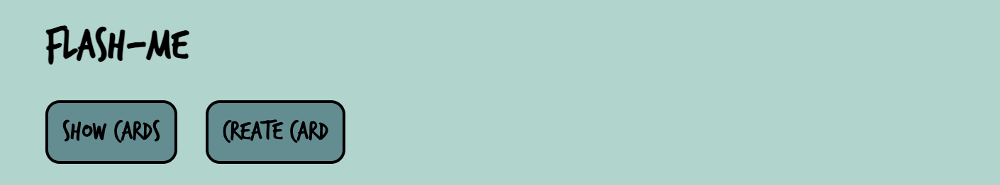

# flash-me

## Description
flash-me is an application for learning languages through the use of flashcards. It works for all languages, but it specializes in dutch with the use of the module for getting information about dutch words: [woorden-api](github.com/emmbryo/woorden-api)

## Dutch twist
When creating a a flascard, you can search for a dutch word and the app will automatically fill in the information on the word.

## The cards
### The words to learn, shown in the source language and with gap sentances with the word to learn missing:

### After the flas button is pressed, the answer is shown: word, pronunciation and the filled sentences:

## Requirements
The requirements for the spplication can be found [here](./requirements.md)

## Testing
[Description](./test/manual-tests/test-description.md) for manual tests.

[Test report](./test/test-report.md) for both manual tests and unit tests.

## Start the application locally:
* run: npm install
* create an .env file with the necessary environmental variable [example](./example.env)
* run: npm run dev

