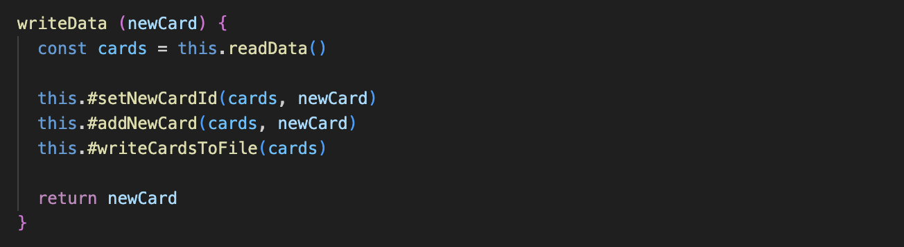

# Reflektioner baserat på boken Clean code av Robert C. Martin

## Kapitel 2: Meningsfulla namn (meaningful names)
Att vara konsekvent i sin namngivning är en viktig aspekt för att undvika förvirring, men jag upptäckte att jag inte namngett mina klasser enligt den principen. Nu handlar det förvisso om en klass i test-delen av applikationen, men tycker ändå det var interssant att se att jag helt plötsligt använt PascalCase för FlascardServiceMock, men använt bindestreck för alla andra klasser; flashcard-service.js, flashcard-service.test.js. En princip att följa är att klassens namn är samma namn som man ger filen, så i detta fall bör jag döpa om min klasser så att de matchar klassernas namn som är skrivna i camelCase.


<hr>

Namngivning av variabler kan vara riltigt lurigt och vad som är självklart för mig, som skrivit koden, behöver inte vara självklart rent objektivt sätt. Namnen ska som boken uttrycker det: reveal intent, alltså det ska på ett tydligt sätt beskriva sin innebörd. Jag brottades med ett speciellt variabelnamn. När användaren söker efter ett namn, så sparas sökordet i en variabel som sedan skickas genom applikationens struktur fram till den plats i koden som själva sökningen görs.

#### In the view create.js, displaying the form where the word is given by the user


#### In the class flashcard-controller.js:


#### In the class flashcard-service.js:


Att, som i de första två exemplen (som egentligen bara är ett och samma exempel, eftersom req.body.search kommer från name="search"), enbart kalla parametern för search indikerar förvisso att det är ngt som ska sökas på, men det blir bra mycket tydligare i service-klassen, där det istället benämns som wordToSearch. Namnet blir dubbelt så långt, men inte tillräckligt för att påverka läsbarheten, men det tillför viktig information att det rör sig om ett ord, vilket indirekt också kan tolkas som en sträng. 

<hr>

## Kapitel 3: Funktioner (Functions)
Boken kan sägas ha en någpt extrem inställning till funktioner. De ska var aså korta som möjligt och ta så få argument som möjligt, helst inga alls. Detta med få antal argument är lite lurigt att följa när man bygger en applikation i express, då man är "fast" med de tre objekten för request, response samt en next()-funktion som gör det möjligt att fånga upp fel eller navigera specialla vägar genom applikationen. Jag har försökt skala ner dessa argument när det är möjligt, men ofta krävs alla tre för att man kunna använda express så som det är tänkt.
#### I klassen flashcard-controller.js:


Bortsett från antalet parametrar, så är dessa funktioner korta och lättöverskådliga samt innehåller abstraktioner som gör deras aktioner lättare att förstå. Det är inte alltid möjligt att skriva den, enligt boken, perfekta funktionen. Men måste man ge avkall på något i ena änden, så bör man jobba hårt med förbättringar i den andra, för att bygga en så enkel och tydlig funktion som är rimligt under förutsättningarna. (index döptes senare om till renderStartView, för att bättre förklara sin mening)
<hr>

### Abstraktion
När applikationen var "klar" letade jag upp den längsta funktionen:
#### I klassen flashcard-repository.js, metoden som skriver data till fil:

Jag upplevde den som rörig och ganska otydlig och valde att jobba mer med namngivningarna samt höja abstraktionsnivån genom att bryta ut funktionaliteten i mindre steg. Resultatet blev en mer lättläst funktion, MEN då fältet för #dataFile inte längre används i metoden, så minskade klassens cohesion. Klassen utökades med tre nya, privata metoer, vilket gjorde klassen större och därmed krångligare. Men då den aktuella metoden blev bra mycket enklare att förstå, får man väga vad som är viktigast i detta fallet. 




## Kapitel 4: Kommentarer (Comments)
Eftersom javascript är ett löst typat språk så kan det vara bra med kommentarer som listar typerna för metoders parametrar, för att underlätta förståelsen när det kommer till vad som accepteras av metoden. Så i detta fall tillför kommentarerna ny information, vilket enligt boken är ett krav för att kunna försvara en kommentars existens. I min controller-klass så används samma parametrar för alla metoder, så jag valde där att göra en sammanfattande kommentar med parametrar för alla klasser. Detta resulterar i några få (nödvändiga?) rader som ger ny info, istället för att lista samma parametrar för varje enskild metod. 


I bilden ovan finns även en kommentar till konstruktorn, där typen för parametern listas, vilket tydliggör exakt vad det är som skall skickas med. Men det ges även ett default-värde i konstruktorn med:
```javascript
const service = new FlashcardService()
```
Så frågan man kan ställa sig här är om denna kommentar faktiskt tillför någon info, eller om det är fullt tillräckligt att inspektera default-parametern i kontruktorn för att kunna ta till sig nödvändig info rörande parameterns typ. Men å andra sidan, om man tar bort kommentarer så öppnar man upp för att konstruktorn även skulle kunna ta in en service av annan typ, så i och med att lägga på en kommentar så tar man bort alla tvivel huruvida den är tänkt att ta en parameter av annan typ.
<hr>

### Gemensamma kommentarer
I mitt fortsatta försök att hålla duplicerade kommentarer som inte tillför något nytt kort, så har vissa metoder kommenterats i grupp på ett naturligt (?) vis. Ett exempel på detta:
#### Från flashcard-repository.js


Tanken är att det ska omedelbart bli uppenbart att de tre metoderna använder samma parametrar. Svårt att säga om jag lyckats, för vad som nu känns självklart för mig, som skrivit koden, behöver inte vara självklart för den som läser min kod. Men jag har gjort ett försök till att effektivisera kommenterandet, men finns säkerligen ytterligare förbättringspotential!

## Kapitel 5: Formattering (Formatting)
Tre stora avsnitt som behandlas i boken gällande formattering är: Vertikala strukturer, horisontella begränsningar och grupperingar av segement inom koden.
Jag har jobbat enligt principen att lista funktioner utifrån hur och när de andvänds.

### Vertikalt
#### Klassen flashcard-repository:


Här används de tre privata metoderna #setNewcardId, #addNewCard och #writeCardsToFile av den publika metoden writeData() och står således efter denne. Den privata metoden #removeCard används av den publika metoden deleteCard() och följer samma mönster. Ett annat sätt att se på det är att lista alla publika metoder överst och sedan de privata längst ner i filen, eftersom de enbart hör till klassens inre och bör kategoriseras för sig. Det senare sättet kanske passar mindre klasser bättre än stora, då man inte behöver bläddra långt för att täcka in alla, men i större klasser kan det vara smidigare att lista dem som i exemplet, men är klassen så stor kanske den istället bör delas upp ...
<hr>

### Gruppering och på tvären
#### I klassen flashcard-service:


Saker som "hör ihop" ska enligt boken grupperas tillsammans, men det är inte alltid självklart vad som hör till vad och var man bör stoppa in en mellanslag för att öka läsbarheten. I exemplet ovan bör kanske de privata metoderna ha ett mellanslag mellan skapandet av konstanterna och array-operationerna, iaf i den metoden med två konstanter, det hade ökat läsbarheten och tydliggjort sammanhang. Det finns även en icke konsekvent beteende gällande retursatsen, som i de private metoderna står för sig själv, medans de i den publika sitter ihop med resten. I den senare gör dock formatet på det som returneras, objektet, att det luftas ut, vilket underlättar läsbarhet även utan mellanslag. Här finns också exempel på radbrytning för att undvika att text går på tvären i oändlighet och ger upphov till den fruktansvärda horisontella scrollningen som kan bryta ner vemsomhelst.
<hr>

### Kommentar till sektionen ovan
Koden i det ovan beskrivna exemplet skrevs senare om för att öka kodförståelsen:


Detta genom att jag I wrapper-klassen för den externa modulen woorden.org (se mer om hur den hanteras under kapitel 8: boundaries) skapade följande funktion för att göra om informationen från woorden-api-metoden getWordInfo() till engelska:


Detta gjorde så att de nederländska termerna inte behövde användas i den övriga koden. Eventuellt skulle man även ha kunnat ha funktionaliteten för att skapa gap sentence i wrappern, men jag ville hålla den så enkel som möjligt. (men ju mer jag funderar på det, ju bättre tycker jag nog att det hade varit för att verkligen separera ut funktionalitet)

Uppdateringen ledde till att koden som ovan visade exempel på gruppering blev förenklad. En metod kunde tas bort samt flera rader kod. Det finns fortfarande exempel på grupperingar, men i mindre skala. (Och som bonus gick service-klassen från 74 till 63 rader kod!)

## Kapitel 6: Objekt och datastrukturer (Objects and Data Structures)
I detta projekt har jag använt mig av klasser och objekt på det stora, men med ett lite för stort undantag. Ett kort skapas som ett fristående objekt, och är då inte knutet till en klass. Hade jag haft en databas för att spara korten i hade det funnits en modell med beskrivning och inbyggda metoder, vilket gjort dem till objekt. men eftersom jag valde att inte ha en DB i detta steg, utan läsa datan från, och skriva den till, fil, så hamnar den i datastrukturfacket. Boken uppmuntrar att man inte ska blanda, så det hade varit mer lämpligt att skapa en egen klass för kort och jobbat utifrån den. För i och med nuvarande struktur så dyker datastrukturen för kort upp lite här och var så om man måste ändra något blir det mycket jobb, i sann datastruktur-anda gällande ändringar av själva datan. 


Inte så lätt att underhålla, hade varit mycket bättre att kunna använda sig av:
```javascript
const card = new Card({ params })
```
Både för default data och data för ett kort, snyggt och avgränsat.
<hr>

### Law of demeter
Denna lag har jag hållt hårt i under detta projekt och gjort mitt bästa för att inte bryta mot den. Jag har nu inte lyckats hitta ett enda ställe (för kaxigt..? ) i koden där den bryts, utan mina objekt kallar bara på metoder av sina närmaste, som i sin tur kallar nästa metod genom kedjan. Detta görs genom strukturen router - controller - service - repository, där alla har sitt huvudområde.
<hr>

## Kapitel 7: Felhantering (Error Handling)
Alla fel kommer i samma form, vilket är by-the-book så att säga. Jag jobbar med undantag som kastas och try-catch-satser som fångar. Hur felen sedan hanteras skiljer sig lite, beroende på vad felet har för ursprung. Detta resulterar i att metoder inte returnerar olika saker beroende på om ngt gått fel eller ej, som boken förespråkar. Undantagen kastas med skräddarsydda meddelanden som försöks hållas korta och konscisa.

Fel som användaren kan vara instresserad av fångas upp och presenteras i vyerna. Andra djupare fel, genererar error-vyer med ganska lite information, bara 400, eller 500 kod och lite förklarande text vad detta är för fel.
#### Felmeddelande till användaren, som här missat att fylla i ett ord:


## Kapitel 8: Gränser (Boundaries)
### Användandet av woorden-api
Det är här som modulen kommer in i bilden. Hur tar man in kod som man inte har någon kontroll över? (Stämmer kanske inte riktigt i detta fall då jag skrivit modulen själv, men man bör ändå hantera den som främmande kod som inte kan litas på till 100%). För att få mer kontroll har jag skapat en wrapper-klass till woorden.org api:et.

#### Klassen WordWrapper.js:


Klassen fångar upp de fel som kastas av modulen, kontrollerar dem och skickar iväg original-felet eller skapar ett nytt, beroende på vad som gått fel. Denna klass begränsar också det tillgängliga gränssnittet då den bara har en metod, till skillnad från woorden-api som har flertalet, men då dessa inte används i applikationen är det onödigt att ha dem tillgängliga. Slutligen översätter wrapperklassen också informationen till engelska, för att öka förståelsen i övriga kosen. I och med detta följer jag bokens beskrivning av att skräddarsy gränssnittet till min applikation och att kapsla in "third-party-code" för att just kunna skräddarsy, men också för att göra applikationen flexibel gentemot extern kod. 
<hr>

## Kapitel 9: Enhetstester (Unit Tests)
Till skillnad från när modulen skrevs har jag denna gång jobbat med enhetstester. Boken är inne och nosar på TDD, men så långt har jag inte gått, men vartefter ny funktionalitet lagts till har enhetstester lagts till och innan ny kos skrivits har jag sett till att testerna gått igenom. Som boken boken förespråkar har jag försökt skriva självförklarande tester vars syfte enkelt ska gå att avkoda endast genom en snabbare titt. Ett annat mål är också att testerna enkelt ska kunna ändras om koden ändras.


Ett problem i min testning är att service klassen inte testas helt isolerat, utan service och repository testas tillsammans, vilket kan göra det svårt att veta var felet ligger om testet inte går igenom och sabbar själva tanken med enehetstester... Tanken var att skapa en mock-klass av repository och injicera i service (så som det är gjort mellan controller och service), men tiden rann iväg. 
<hr>

## Kapitel 10: Klasser (Classes)
Några viktiga aspekter som tas upp av boken är att hålla nere klassernas storlek och att de följer SRP: Single Responsibility Principle. Jag har byggt upp applikationen utefter: { router-controller-service-repository }-mönstret, men inledningsvis, eftersom jag inte har någon databas utan läser från fil, implementerade jag inte någon repository-klass och hade funktionaliteten rörande läsa/skriva till fil i service-klassen. Detta ledde till att service klassen bröt mot SRP, så jag skapade en repository-klass för att hantera läsa/skriva data. Serviceklassen hade dessutom låg cohesion eftersom bara hälften av klassens metoder använde sig av fälten som innehöll information gällande från vilken fil datan skulle läsas/skrivas. När denna funktionalitet istället fick en egen klass, hade jag nu istället två separata klasser, var och en med mycket högre cohesion.

Gällande storleken på klasserna är det inte så att man i alla fall kan se hela klassen i editorn, men den längste av dem är 79 rader (flashcard-controller.js). Den längsta filen är server.js, som konfigurerar upp express.js, med 112 rader.

#### Fördelningen av koden i projektet:


## Kapitel 11: System (Systems)
Handlar ofta om team work, vilket inte riktigt går att applicera på detta projekt. Boken poängterar att det blir extra viktigt med SoC: Separation of Concerns när man jobbar i team, så varje del av projektet kan utvecklas mer eller mindre isolerat. Det talas också om att standarder är viktiga, men att de inte följas blint, utan bara när det är försvarbart, detta också för att hålla olika delar så "fria" som möjligt. 

System ska byggas i små, fungerande steg. Jämförelse med att bygga en stad görs, man bygger bit för bit och skalar upp efter hand.

I detta projekt har jag jobbat med SoC i tanken och försökt dela upp projektet i mindre, testbara bitar och gjort vad jag kan för att undvika så kallad spaghettikod, som är svårhanterad, ostrukturerad och knappt testbar. Också använt designprincipen IoC: Inversion of Control genom att använda en IoCContainer för att hantera beroenden och ge en bild över projektets struktur.

#### Registering av klasserna i bootstrap.js, konfiguration till containern:

