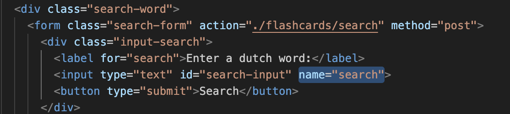

# Reflektioner baserat på boken Clean code av Robert C. Martin

## Kapitel 2: Meningsfulla namn (meaningful names)
Att vara konsekvent i sin namngivning är en viktig aspekt för att undvika förvirring, men jag upptäckte att jag inte namngett mina klasser enligt den principen. Nu handlar det förvisso om en klass i test-delen av applikationen, men tycker ändå det var interssant att se att jag helt plötsligt använt PascalCase för FlascardServiceMock, men använt bindestreck för alla andra klasser; flashcard-service.js, flashcard-service.test.js. En princip att följa är att klassens namn är samma namn som man ger filen, så i detta fall bör jag döpa om min klasser så att de matchar klassernas namn som är skrivna i camelCase.


<hr>

Namngivning av variabler kan vara riltigt lurigt och vad som är självklart för mig, som skrivit koden, behöver inte vara självklart rent objektivt sätt. Namnen ska som boken uttrycker det: reveal intent, alltså det ska på ett tydligt sätt beskriva sin innebörd. Jag brottades med ett speciellt variabelnamn. När användaren söker efter ett namn, så sparas sökordet i en variabel som sedan skickas genom applikationens struktur fram till den plats i koden som själva sökningen görs.

#### In the view create.js, displaying the form where the word is given by the user


#### In the class flashcard-controller.js:


#### In the class flashcard-service.js:


Att, som i de första två exemplen (som egentligen bara är ett och samma exempel, eftersom req.body.search kommer från name="search"), enbart kalla parametern för search indikerar förvisso att det är ngt som ska sökas på, men det blir bra mycket tydligare i service-klassen, där det istället benämns som wordToSearch. Namnet blir dubbelt så långt, men inte tillräckligt för att påverka läsbarheten, men det tillför viktig information att det rör sig om ett ord, vilket indirekt också kan tolkas som en sträng. 

<hr>

### html vs javascript

<hr>

## Kapitel 3: Funktioner (Functions)
Boken kan sägas ha en någpt extrem inställning till funktioner. De ska var aså korta som möjligt och ta så få argument som möjligt, helst inga alls. Detta med få antal argument är lite lurigt att följa när man bygger en applikation i express, då man är "fast" med de tre objekten för request, response samt en next()-funktion som gör det möjligt att fånga upp fel eller navigera specialla vägar genom applikationen. Jag har försökt skala ner dessa argument när det är möjligt, men ofta krävs alla tre för att man kunna använda express så som det är tänkt.
#### I klassen flashcard-controller.js:


Bortsett från antalet parametrar, så är dessa funktioner korta och lättöverskådliga samt innehåller abstraktioner som gör deras aktioner lättare att förstå. Det är inte alltid möjligt att skriva den, enligt boken, perfekta funktionen. Men måste man ge avkall på något i ena änden, så bör man jobba hårt med förbättringar i den andra, för att bygga en så enkel och tydlig funktion som är rimligt under förutsättningarna.
<hr>

### Abstraktion
När applikationen var "klar" letade jag upp den längsta funktionen:
#### I klassen flashcard-repository.js, metoden som skriver data till fil:

Jag upplevde den som rörig och ganska otydlig och valde att jobba mer med namngivningarna samt höja abstraktionsnivån genom att bryta ut funktionaliteten i mindre steg. Resultatet blev en mer lättläst funktion, MEN då fältet för #dataFile inte längre används i metoden, så minskade klassens cohesion. Klassen utökades med tre nya, privata metoer, vilket gjorde klassen större och därmed krångligare. Men då den aktuella metoden blev bra mycket enklare att förstå, får man väga vad som är viktigast i detta fallet. 


## Kapitel 4: Kommentarer (Comments)
Eftersom javascript är ett löst typat språk så kan det vara bra med kommentarer som listar typerna för metoders parametrar, för att underlätta förståelsen när det kommer till vad som accepteras av metoden. Så i detta fall tillför kommentarerna ny information, vilket enligt boken är ett krav för att kunna försvara en kommentars existens. I min controller-klass så används samma parametrar för alla metoder, så jag valde där att göra en sammanfattande kommentar med parametrar för alla klasser. Detta resulterar i några få (nödvändiga?) rader som ger ny info, istället för att lista samma parametrar för varje enskild metod. 


I bilden ovan finns även en kommentar till konstruktorn, där typen för parametern listas, vilket tydliggör exakt vad det är som skall skickas med. Men det ges även ett default-värde i konstruktorn med:
```javascript
const service = new FlashcardService()
```
Så frågan man kan ställa sig här är om denna kommentar faktiskt tillför någon info, eller om det är fullt tillräckligt att inspektera default-parametern i kontruktorn för att kunna ta till sig nödvändig info rörande parameterns typ. Men å andra sidan, om man tar bort kommentarer så öppnar man upp för att konstruktorn även skulle kunna ta in en service av annan typ, så i och med att lägga på en kommentar så tar man bort alla tvivel huruvida den är tänkt att ta en parameter av annan typ.

## Kapitel 5: Formattering (Formatting)
Tre stora avsnitt som behandlas i boken gällande formattering är: Vertikala strukturer, horisontella begränsningar och grupperingar av segement inom koden.
Jag har jobbat enligt principen att lista funktioner utifrån hur och när de andvänds.

### Vertikalt
#### Klassen flashcard-repository:


Här används de tre privata metoderna #setNewcardId, #addNewCard och #writeCardsToFile av den publika metoden writeData() och står således efter denne. Den privata metoden #removeCard används av den publika metoden deleteCard() och följer samma mönster. Ett annat sätt att se på det är att lista alla publika metoder överst och sedan de privata längst ner i filen, eftersom de enbart hör till klassens inre och bör kategoriseras för sig. Det senare sättet kanske passar mindre klasser bättre än stora, då man inte behöver bläddra långt för att täcka in alla, men i större klasser kan det vara smidigare att lista dem som i exemplet, men är klassen så stor kanske den istället bör delas upp ...
<hr>

### Gruppering och på tvären
#### I klassen flashcard-service:


Saker som "hör ihop" ska enligt boken grupperas tillsammans, men det är inte alltid självklart vad som hör till vad och var man bör stoppa in en mellanslag för att öka läsbarheten. I exemplet ovan bör kanske de privata metoderna ha ett mellanslag mellan skapandet av konstanterna och array-operationerna, iaf i den metoden med två konstanter, det hade ökat läsbarheten och tydliggjort sammanhang. Det finns även en icke konsekvent beteende gällande retursatsen, som i de private metoderna står för sig själv, medans de i den publika sitter ihop med resten. I den senare gör dock formatet på det som returneras, objektet, att det luftas ut, vilket underlättar läsbarhet även utan mellanslag. Här finns också exempel på radbrytning för att undvika att text går på tvären i oändlighet och ger upphov till den fruktansvärda horisontella scrollningen som kan bryta ner vemsomhelst.

## Kapitel 6: Objekt och datastrukturer (Objects and Data Structures)
Gränsdragning mellan publikt och privat inom klassen
Abstraktioner kring word parametern, är det lätt add addera saker bakom kulisserna?
Finns det någon dold datastruktur i appen, man ska inte blanda!
Law of demeter, finns det gränsfall i koden?
Data nås genom actions, inte genom att man får den direkt

## Kapitel 7: Felhantering (Error Handling)
Hur hantera felen från woorden-api, egna undantag
Fel ska hanteras med tydlighet, inte poppa upp lite här och var i olika form.
Undantag före felkoder
Undantagen ska komma med flrklaring om sammanhang

## Kapitel 8: Gränser (Boundaries)
Användandet av woorden-api
Kapsla in användandet av externa moduler? Eget interface till woorden-api?
Klarar gränsen av ändringar i modulen?
Gränsen måste hållas lätt att underhålla, redo att hantera ändringar
Finns det spänningar mellan flash-me och woorden-api?

## Kapitel 9: Enhetstester (Unit Tests)
Testa tidigt, kanske till och med innan koden skrivs? TDD
Kan testerna anpassas till ändringar i koden på ett enkelt sätt?
Är testerna läsbara så man direkt kan förstå exakt vad som testas

## Kapitel 10: Klasser (Classes)
Hur är klassen organiserad, vilken ordning kommer grejerna?
privata metoder i botten, men går detta emot vertikal formattering? Ska de delas upp så att de ligger efter de publika metoder som kallar dem, eller är det mer naturligt att gruppera dem utifrån publik/privat??
Inte för stora!
Single Responsibility Principle!
Ett användningsområde = bara en anledning att ändra klassen
Kolla cohesion! Används fälten i alla metoder? = antalet fält ska inte vara för stort, då kan det var läge att bryta upp

## Kapitel 11: System (Systems)
Handlar ofta om team work, vilket inte riktigt går att applicera på detta projekt.
Decentraliserat, separation of concerns
Standarder mycket viktiga, men skall inte följas blint, utan bara när det är försvarbart
Hålla olika delar så "fria" som möjligt

## Sammanfattning
var finns de största problemen, vad kommer naturligt, vad mäste man tänka på?