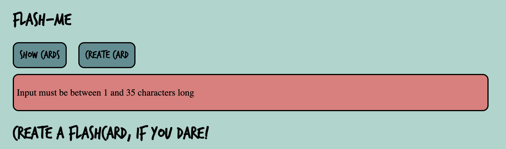
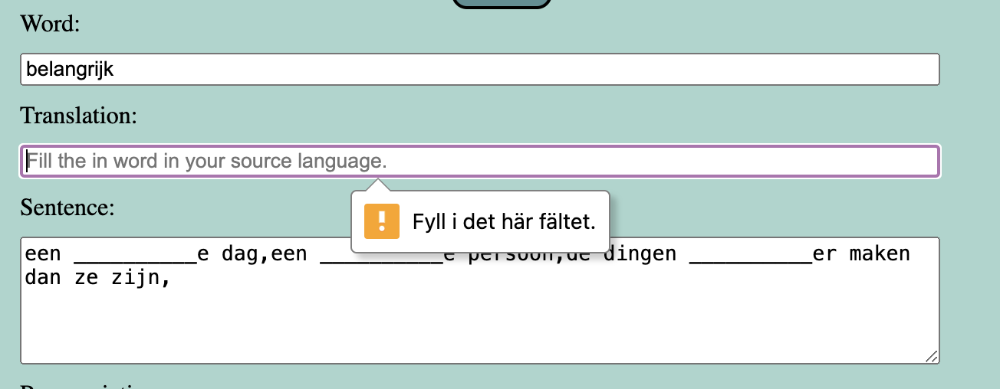

# Test description - manual tests

1. Make sure to create an .env file with the necessary variables (see example.env)
2. run npm install 
3. Start the application with npm run dev
4. Go to localhost:PORT in a browser

## 1: Start view
1.1 The startview should contain:
  * headline: flash-me
  * Button: show cards
  * Button: create card

## 2: Show cards
2.1 Click the button show cards
* All previously made cards should be shown in a three column pattern

### Flash!
2.2: Press the flash button on serveral cards
* The cards should alternate between front and back. The front of the card shows the word in the source language and a gap sentence. The back shows the word to learn, possibly the pronunciation, and the sentence with no gap.

### Delete
2.3 Press the delete button on sesveral cards
* For each card: The side should reload and the deleted card should no longer be a part of your deck.

## 3: Create card
### Click it
3.1 Click the button create card
* A form should appear:
  * The top part shows an input field and a search button
  * The bottom part is a form with several input fields (word, translation, gap sentence/sentences, pronunciation and full sentence/sentences and a save button)
  * There should be a warning text at the bottom of the page, describing the limitations of the automatic process for filling in the word info

### Search a word
3.2: Type in the dutch word belangrijk and press the search button
* The form should automatically fill in all input fields, except for translation.

### Save the card
3.3: Fill in the english translation for belangrijk: important and click save
* A new side with the card opens
* Feel free to test the flash button, but don't delete the card

### Misbehave in the search
3.4: Click on the create card button and write jibberish in the search field
* A warning should appear over the input field telling you that the word is not found.
3.5: Make sure the input field is empty, then press search
* A warning should appear over the input field telling you that the word must be between 1 and 35 characters long.
3.6: Try filling in big texts in the different fields
* 

## 4: The form
4.1: Again type in the dutch word belangrijk and press the search button and click save
* A message appears, telling you to fill in a translation
4.2: Fill in the word important in the translation input and remove the word belangrijk from the input for word
* A message appears, telling you to fill in the word

