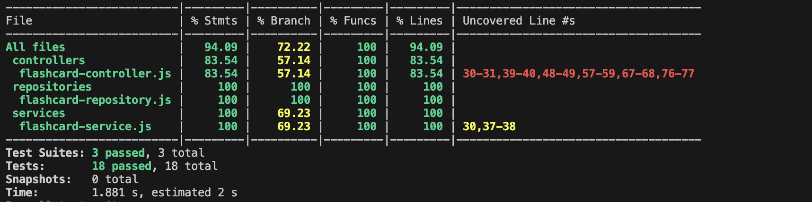
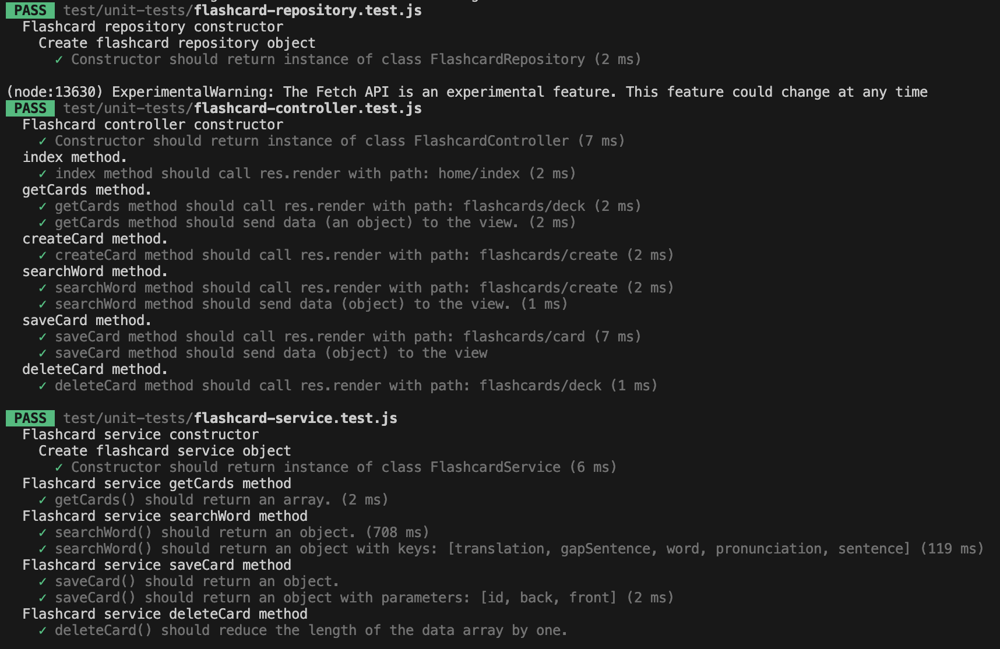

# Test report

## Manual testing - Interface
link to: [test description](./manual-tests/test-description.md)

link to: [requirements](../requirements.md)

| test | OK | Requirement | Comment |
|----------|----------|----------|------|
| 1.1 | ✅ | 1 | - |
| 2.1 | ✅ | 2 | - |
| 2.2 | ✅ | 2 | - |
| 2.3 | ✅ | 2, 4.3 | - |
| 3.1 | ✅ | 3 | - |
| 3.2 | ✅ | 3 | - |
| 3.3 | ✅ | 3, 4.1 | - |
| 3.4 | ✅ | 3 | - |
| 3.5 | ✅ | 3 | - |
| 3.6 | ✅ | 3 | - |
| 4.1 | ✅ | 5 | - |
| 4.2 | ✅ | 5 | - |

## Unit tests
link to: [test code](./unit-tests/)

### Results:

### Verbose output:

## Comments

